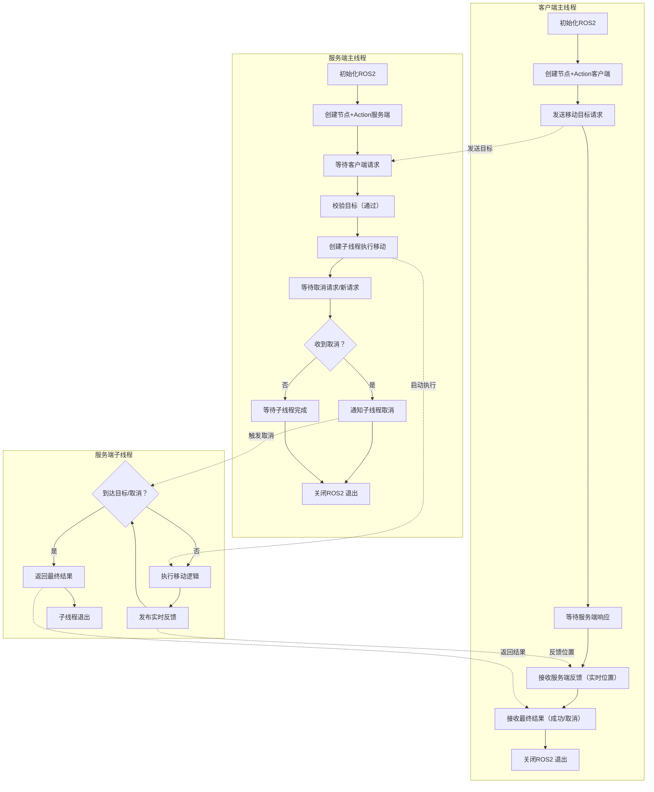
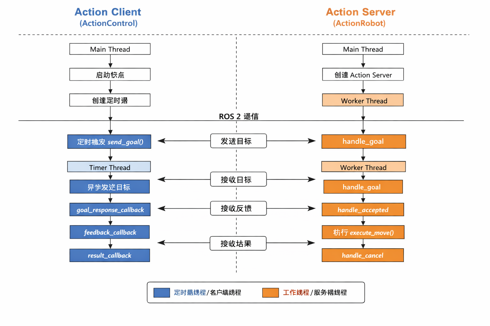

（1）详细流程

```mermaid
flowchart TD
    %% 第一条：客户端主线程（仅核心流程）
    subgraph 客户端主线程
        C1["初始化ROS2"] --> C2["创建节点+Action客户端"]
        C2 --> C3["发送移动目标请求"]
        C3 --> C4["等待服务端响应"]
        C4 --> C5["接收服务端反馈（实时位置）"]
        C5 --> C6["接收最终结果（成功/取消）"]
        C6 --> C7["关闭ROS2 退出"]
    end

    %% 第二条：服务端主线程（仅核心流程）
    subgraph 服务端主线程
        S1["初始化ROS2"] --> S2["创建节点+Action服务端"]
        S2 --> S3["等待客户端请求"]
        S3 --> S4["校验目标（通过）"]
        S4 --> S5["创建子线程执行移动"]
        S5 --> S6["等待取消请求/新请求"]
        S6 --> S7{"收到取消？"}
        S7 -->|是| S8["通知子线程取消"]
        S7 -->|否| S9["等待子线程完成"]
        S8 & S9 --> S10["关闭ROS2 退出"]
    end

    %% 第三条：服务端子线程（仅核心流程）
    subgraph 服务端子线程
        T1["执行移动逻辑"] --> T2["发布实时反馈"]
        T2 --> T3{"到达目标/取消？"}
        T3 -->|否| T1
        T3 -->|是| T4["返回最终结果"]
        T4 --> T5["子线程退出"]
    end

    %% 核心交互（虚线箭头，只保留关键）
    C3 -. 发送目标 .-> S3
    S5 -. 启动执行 .-> T1
    T2 -. 反馈位置 .-> C5
    S8 -. 触发取消 .-> T3
    T4 -. 返回结果 .-> C6
```

（2）整体流程
